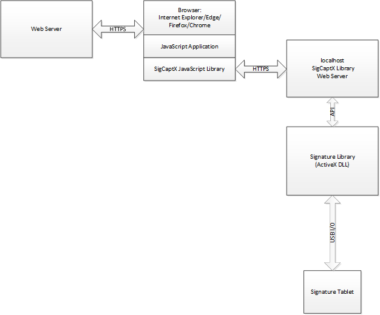

# Wacom Ink SDK for signature - Windows SigCaptX

## Introduction

---

In the *Wacom Ink SDK for signature* the SigCaptX Library is an extension of the Signature Library.
The SigCaptX Library allows a signature enabled web application to be used in a range of browsers thereby giving cross-browser support.
Previously a signature enabled web application could only be used in Internet Explorer using ActiveX technology.
The product has been tested with Internet Explorer, MS Edge, Chrome and Firefox.

A prerequisite is the installation of the Wacom Signature Library, see: *Wacom Ink SDK for signature - Windows*
SigCaptX is supplied as a 32-bit application and requires the 32-bit version of the Signature Library, regardless of your Windows version.
To simplify the installation a combined installer is provided.


## Overview

In a browser with no ActiveX support it is not possible to access the Signature Library directly.
Instead calls are made indirectly via a localhost web server which is installed as part of the SigCaptX Library.
The SigCaptX JavaScript library is provided to give access to the local web server.
JSONP communication is used as the interface to the local web server using HTTPS requests.
 
To view the solution schematically:



The general process is as follows: 
 
*	The web browser loads an HTML page containing JavaScript application code from the web server. The application code includes the SDK framework required to access the localhost web server. 
*	To perform Signature SDK functions, the application code calls the localhost server through the SDK framework. The framework functions either use a Websocket or make a JSONP HTTPS request to the localhost server and supply a dedicated callback function. The framework functions return immediately, leaving the server to run independently. 
*	The server actions the framework function by calling the Signature SDK DLL. For example, in the case of signature capture the DLL performs the necessary i/o with the signature tablet. 
*	On completion the server again uses the Websocket or uses the JSONP technique to start the callback function which was supplied in the request, passing the relevant return data. 
*	The callback function retrieves the data and completes the operation. 
*	For example, in the case of signature capture the HTML application calls the signature capture framework function. Its callback function calls the renderBitmap framework function to request the image of the signature. Its callback function displays the signature image in the html page.  

The use of Websocket or JSONP requests is transparent inside the SDK and makes no difference to SDK use.


To illustrate, an html page creates the signature image display area:

```ruby
<div id="imageBox" class="boxed" style="height:35mm;width:60mm; border:1px solid #d3d3d3;">
</div>

JavaScript application code provides the necessary functionality. For example to capture a signature:

function capture()
{
  if(!wgssSignatureSDK.running || null == dynCapt)
  {
    print("Session error. Restarting the session.");
    actionWhenRestarted(window.Capture);   // See SigCaptX-SessionControl.js
    return;
  }

  // Construct a hash object to contain the hash
  var hash = new wgssSignatureSDK.Hash(onHashConstructor);
  
  function onHashConstructor(hashV, status)
  {
    if(wgssSignatureSDK.ResponseStatus.OK == status)
    {
      GetHash(hash, onGetInitialHash);
    }
    else
    {
      print("Hash Constructor error: " + status);
      if(wgssSignatureSDK.ResponseStatus.INVALID_SESSION == status)
      {
        print("Error: invalid session. Restarting the session.");
        actionWhenRestarted(window.Capture);
      }
    }
  }
  
  // If the hash value has been calculated successfully next steps is to capture the signature
  function onGetInitialHash()
  {
    var firstName = document.getElementById("fname").value;
    var lastName = document.getElementById("lname").value;
    var fullName = firstName + " " + lastName;
    
    dynCapt.Capture(sigCtl, fullName, "Document Approval", hash, null, onDynCaptCapture);
  }  // the callback function runs when signature capture completes (OK or Cancel)   
  function onDynCaptCapture(dynCaptV, SigObjV, status)
  {
    if(wgssSignatureSDK.ResponseStatus.INVALID_SESSION == status)
    {
      print("Error: invalid session. Restarting the session.");
      actionWhenRestarted(window.Capture);  // See SigCaptX-SessionControl.js
    }
    else
    {
      /* Check the status returned from the signature capture */
      switch( status ) 
      {
        case wgssSignatureSDK.DynamicCaptureResult.DynCaptOK:
          sigObj = SigObjV;
          print("Signature captured successfully");

          /* Set the RenderBitmap flags as appropriate depending on whether the user wants to use a picture image or B64 text value */
          if (document.getElementById("chkUseB64Image").checked)
          {
             var outputFlags = wgssSignatureSDK.RBFlags.RenderOutputBase64 | wgssSignatureSDK.RBFlags.RenderColor32BPP;
          } 
          else
          {
             var outputFlags = wgssSignatureSDK.RBFlags.RenderOutputPicture | wgssSignatureSDK.RBFlags.RenderColor32BPP;
          }
          sigObj.RenderBitmap(BITMAP_IMAGEFORMAT, imageBox.clientWidth, imageBox.clientHeight, BITMAP_INKWIDTH, BITMAP_INKCOLOR, BITMAP_BACKGROUNDCOLOR, outputFlags, BITMAP_PADDING_X, BITMAP_PADDING_Y, onRenderBitmap);
          break;

        case wgssSignatureSDK.DynamicCaptureResult.DynCaptCancel:
          print("Signature capture cancelled");
          break;
          
        case wgssSignatureSDK.DynamicCaptureResult.DynCaptPadError:
          print("No capture service available");
          break;
          
        case wgssSignatureSDK.DynamicCaptureResult.DynCaptError:
          print("Tablet Error");
          break;
          
        case wgssSignatureSDK.DynamicCaptureResult.DynCaptNotLicensed:
          print("No valid Signature Capture licence found");
          break;
          
        default: 
          print("Capture Error " + status);
          break;
      }
    }
  }

  function onRenderBitmap(sigObjV, bmpObj, status) 
  {
    if(wgssSignatureSDK.ResponseStatus.OK == status) 
    {
      var imageBox = document.getElementById("imageBox");
      var useB64Image = document.getElementById("chkUseB64Image").checked;

      /* If the user wants to demonstrate the use of B64 image strings then define an image and set its source to the B64 string*/
      if (useB64Image)
      {
         print("base64_image:>"+bmpObj+"<");
         img = new Image();
         img.src = "data:image/png;base64," + bmpObj;
  
         if(null == imageBox.firstChild)
         {
           imageBox.appendChild(img);
         }
         else
         {
            imageBox.replaceChild(img, imageBox.firstChild);
         }
      }
      else
      {
         /* If RenderBitmap generated a standard image (picture) then just place that picture in the img control on the HTML form */
         if(null == imageBox.firstChild)
         {
           imageBox.appendChild(bmpObj.image);
         }
         else
         {
            imageBox.replaceChild(bmpObj.image, imageBox.firstChild);
         }
      }
      /* If the user chose the option to show the SigText value on the form then call the function to do this */
      if (document.getElementById("chkShowSigText").checked)
      {
         sigObjV.GetSigText(onGetSigText);
      }
    } 
    else 
    {
      print("Signature Render Bitmap error: " + status);
    }
  } 

```
---

# Additional resources 

## Sample Code
For further samples check Wacom's Developer additional samples, see [https://github.com/Wacom-Developer](https://github.com/Wacom-Developer)

## Documentation
For further details on using the SDK see [Wacom Ink SDK for signature documentation](http://developer-docs.wacom.com/sdk-for-signature/) 

The API Reference is available directly in the downloaded SDK.

## Support
If you experience issues with the technology components, please see related [FAQs](https://developer-support.wacom.com/hc/en-us)

For further support file a ticket in our **Developer Support Portal** described here: [Request Support](https://developer-support.wacom.com/hc/en-us/requests/new)

## Developer Community 
Join our developer community:

- [LinkedIn - Wacom for Developers](https://www.linkedin.com/company/wacom-for-developers/)
- [Twitter - Wacom for Developers](https://twitter.com/Wacomdevelopers)

## License 
This sample code is licensed under the [MIT License](https://choosealicense.com/licenses/mit/)

---
